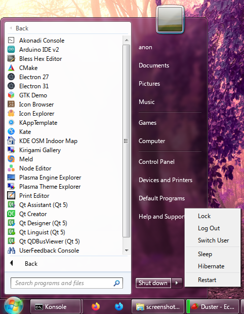
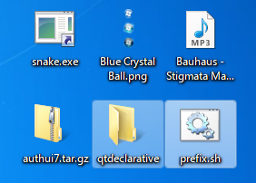
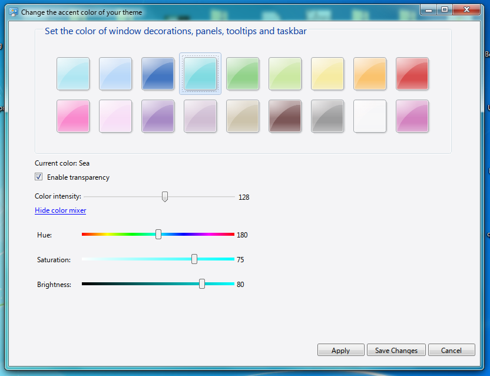
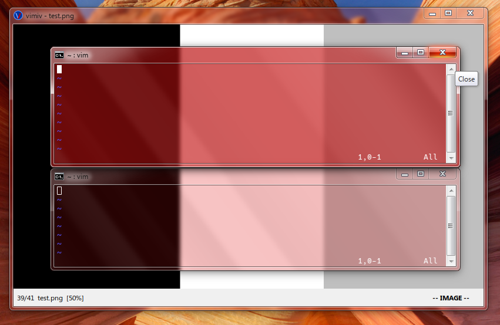
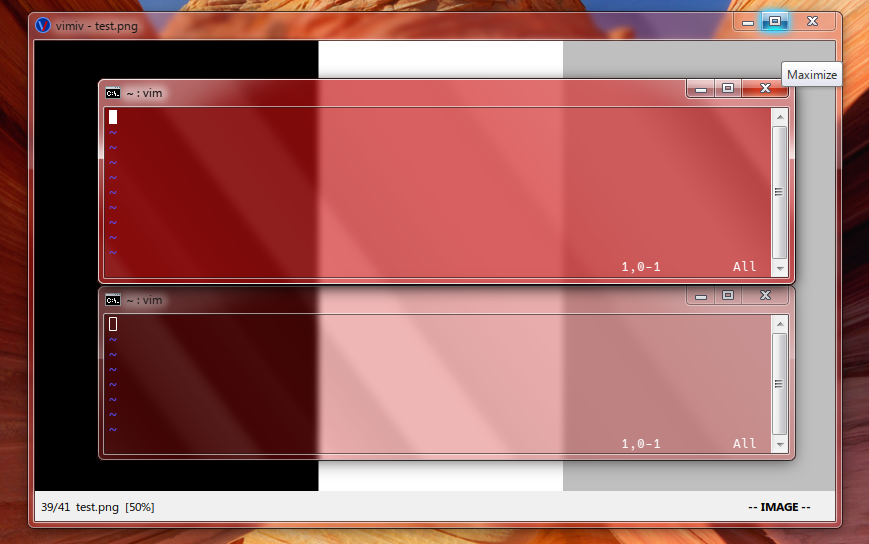

# AEROTHEMEPLASMA FOR KDE 6

## WARNING: This version is very early WIP and is not fully finished. Proceed with caution.

## Microsoft® Windows™ is a registered trademark of Microsoft® Corporation. This name is used for referential use only, and does not aim to usurp copyrights from Microsoft. Microsoft Ⓒ 2024 All rights reserved. All resources belong to Microsoft Corporation.

## Introduction

This is a project which aims to recreate the look and feel of Windows 7 as much as possible on KDE Plasma, whilst adapting the design to fit in with modern features provided by KDE Plasma and Linux.
It is still in heavy development and testing. ATP has been tested on:

1. Arch Linux x64 and other Arch derivatives, KDE Neon
2. Plasma 6.2.2, KDE Frameworks 6.7.0, Qt 6.8.0
3. 96 DPI scaling, multi monitor
4. X11, Wayland*

*AeroThemePlasma currently lacks full Wayland support, which may result in Wayland-specific issues. 

**This release is meant for early adopters, debuggers and developers alike. This port lacks certain components which still need to be ported over to KDE Plasma 6. I am not responsible for broken systems, please proceed with caution.**

The Plasma 5 version of ATP is available as a tag in this repository, however it is unmaintained and no longer supported.

If you find my work valuable consider donating:

## Installation

See [INSTALL.md](./INSTALL.md) for a detailed installation guide.

## Credits 

Huge thanks to everyone who helped out along the way by contributing, testing, providing suggestions and generally making ATP possible:

### Forked code

- Intika's [Digital Clock Lite](https://store.kde.org/p/1225135/) plasmoid
- [Adhe](https://store.kde.org/p/1386465/), [oKcerG](https://github.com/oKcerG/QuickBehaviors) and [SnoutBug](https://store.kde.org/p/1720532) for making SevenStart possible
- Zren's [Win7 Show Desktop](https://store.kde.org/p/2151247) plasmoid
- [Mirko Gennari](https://store.kde.org/p/998614), DrGordBord and [bionegative](https://www.pling.com/p/998823) for making SevenBlack possible
- DrGordBord's [Windows 7 Kvantum](https://store.kde.org/p/1679903) theme
- [taj-ny](https://github.com/taj-ny)'s [kwin-effects-forceblur](https://github.com/taj-ny/kwin-effects-forceblur)

### Contributors
- [Souris-2d07](https://gitgud.io/souris) for making the following: 
    - Cursor theme
    - Plymouth theme 
    - SDDM theme
    - KWin decoration theme
    - Most KWin C++ effects
    - Other minor KWin features and scripts
- [That Linux Dude Dominic Hayes](https://github.com/dominichayesferen) for making the following: 
    - Lock screen UI 
    - Icon theme
- [QuinceTart10](https://github.com/QuinceTart10) and [Gamer95875](https://github.com/Gamer95875) for making the sound themes
- (In collaboration with) [kfh83](https://github.com/kfh83), [TorutheRedFox](https://github.com/TorutheRedFox) and [ALTaleX](https://github.com/ALTaleX531/dwm_colorization_calculator/blob/main/main.py) for figuring out accurate Aero glass blur and colorization effects
- [AngelBruni](https://github.com/angelbruni) for contributing several SVG textures, most notably the clock in DigitalClockLite Seven
- [ricewind012](https://github.com/ricewind012/) for .bashrc Microsoft Windows header

### Special Thanks 

- [MondySpartan](https://www.deviantart.com/mondyspartan/art/Windows-10-Year-2010-Edition-1016859431) for inspiring the notification design

### Cool projects you should really check out

- [Geckium](https://github.com/angelbruni/Geckium) by AngelBruni
- [Aero UserChrome](https://gitgud.io/souris/aero-userchrome) by Souris (Geckium in combination with Aero UserChrome works well with AeroThemePlasma)
- [VistaThemePlasma](https://gitgud.io/catpswin56/vistathemeplasma/) by catpswin56
- [LonghornThemePlasma](https://gitgud.io/catpswin56/longhornthemeplasma) by catpswin56
- [VB1ThemePlasma](https://gitgud.io/catpswin56/vista-beta-plasma) by catpswin56
- [Gadgets](https://gitgud.io/catpswin56/win-gadgets) by catpswin56
- [Ice2K.sys](https://toiletflusher.neocities.org/ice2k/) by 0penrc

## Vista variant

Initially I wanted to make a Vista variant of AeroThemePlasma but [catpswin56](https://gitgud.io/catpswin56) beat me to it, use [VistaThemePlasma](https://gitgud.io/catpswin56/vistathemeplasma/) if you want a Vista theme.

## Screenshots

### Desktop

### Start Menu

### Clock

### System Tray

### Notifications 

### Desktop Icons 

### Lockscreen 

### Aero Peek

### Alt-Tab Switcher

### Colorization 

Regular colorization:

Basic colorization:

Maximized opaque colorization:

### Decorations

Decoration themes:

### Firefox

### Taskbar (Coming Soon™)

